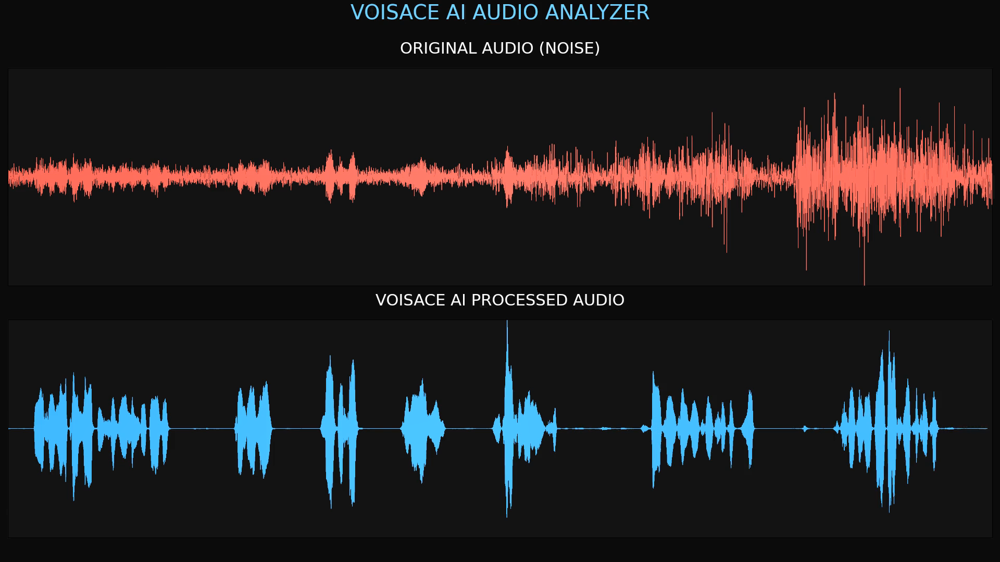

# Voisace AI Noise Reduction Demo

AI-powered speech enhancement and noise reduction technology demonstration by Voisace.

---

## Demo Video

Watch the demonstration on YouTube:

https://youtu.be/ZUOCqbJAlvE

---

## Overview

This demo showcases Voisace's AI Noise Reduction technology under extremely challenging acoustic conditions.

The original audio contains strong wind noise and natural environmental background sounds. Voisace's AI model suppresses unwanted noise while preserving speech intelligibility, clarity, and natural voice characteristics.

---

## Demo Scenario

* Language: Czech
* Noise Type: Wind Noise + Nature Sounds
* SNR: -12dB
* Format: Before vs After Comparison
* Technology: AI Noise Reduction / Speech Enhancement

---

## Key Features

* AI-powered noise reduction
* Speech enhancement
* Wind noise suppression
* Environmental noise removal
* Voice clarity improvement
* Real-time processing capability
* Embedded AI deployment ready

---

## Applications

* Smart Conference Systems
* Meeting Rooms
* Video Conferencing
* Contact Centers
* AI Voice Assistants
* Mobile Devices
* Embedded Audio Systems
* Enterprise Communication

---

## About Voisace

Voisace develops advanced AI-powered audio technologies for conference systems, enterprise communication, speech enhancement, and intelligent audio processing.

### Website

https://www.voisace.com

### GitHub

https://github.com/VOISACEAI

### LinkedIn

https://www.linkedin.com/company/voisace

### Contact

[sales@voisace.com](mailto:sales@voisace.com)

---

© Voisace. All Rights Reserved.
